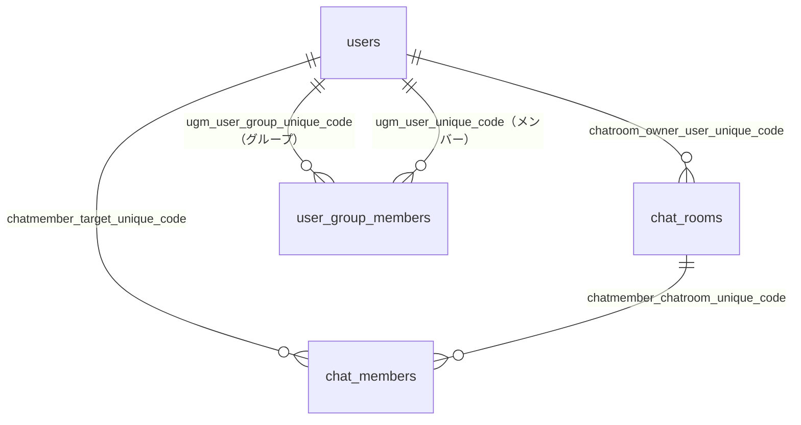

# chat-service ER図（主要4テーブル）

記録日時: 2026-01-27 17:09:27

## 学んだこと

### 対象テーブル

chat-serviceデータベースの主要4テーブルの構造とリレーションシップを整理した。

### テーブル構造

#### 1. users（ユーザー）
| カラム | 型 | 説明 |
|--------|------|------|
| user_id | bigint | PK |
| user_unique_code | text | UK（他テーブルからの参照キー） |
| user_o_unique_code | text | FK → organizations |
| user_ou_unique_code | text | FK → organization_units |
| user_type | text | FK → user_types |
| user_name | text | ユーザー名 |
| user_is_disabled | int | 削除フラグ（1=削除済み） |

#### 2. chat_rooms（チャットルーム）
| カラム | 型 | 説明 |
|--------|------|------|
| chatroom_id | bigint | PK |
| chatroom_unique_code | text | UK（他テーブルからの参照キー） |
| chatroom_type | text | FK → chat_room_types |
| chatroom_owner_o_unique_code | text | FK → organizations（オーナー組織） |
| chatroom_owner_user_unique_code | text | FK → users（オーナーユーザー） |
| chatroom_title | text | ルームタイトル |
| chatroom_is_disabled | int | 削除フラグ（1=削除済み） |

#### 3. chat_members（チャットメンバー）
| カラム | 型 | 説明 |
|--------|------|------|
| chatmember_id | bigint | PK |
| chatmember_unique_code | text | UK |
| chatmember_chatroom_unique_code | text | FK → chat_rooms |
| chatmember_target_unique_code | text | FK → users |
| chatmember_type | text | FK → chat_member_types（user/user_group） |
| chatmember_role | text | FK → chat_member_roles |
| chatmember_related_to | text | 親アイテムのユニークコード |
| chatmember_unread_count | int | 未読数 |
| chatmember_is_disabled | int | 削除フラグ（1=削除済み） |

#### 4. user_group_members（ユーザーグループメンバー）
| カラム | 型 | 説明 |
|--------|------|------|
| ugm_id | bigint | PK |
| ugm_unique_code | text | UK |
| ugm_user_group_unique_code | text | FK → users（グループ） |
| ugm_user_unique_code | text | FK → users（メンバー） |
| ugm_is_disabled | int | 削除フラグ（1=削除済み） |

### リレーションシップ

### 重要なポイント

1. **usersテーブルの二重の役割**
   - 個人ユーザー（user_type = 'user'など）
   - ユーザーグループ（user_type = 'user_group'）
   - 両方とも同じusersテーブルで管理される

2. **chat_membersのchatmember_type**
   - `user`: 個人ユーザーがメンバー
   - `user_group`: グループ単位でメンバー追加

3. **user_group_membersの構造**
   - ugm_user_group_unique_code: グループを表すユーザー
   - ugm_user_unique_code: グループに所属する個人ユーザー
   - usersテーブルへの自己参照的な構造

4. **論理削除パターン**
   - 全テーブルで `*_is_disabled` フラグによる論理削除を採用
   - 物理削除はトリガーで禁止されている（chat_rooms, chat_members）

### スキーマファイルの場所

`backend/migration/origin/0000_schema.sql`
